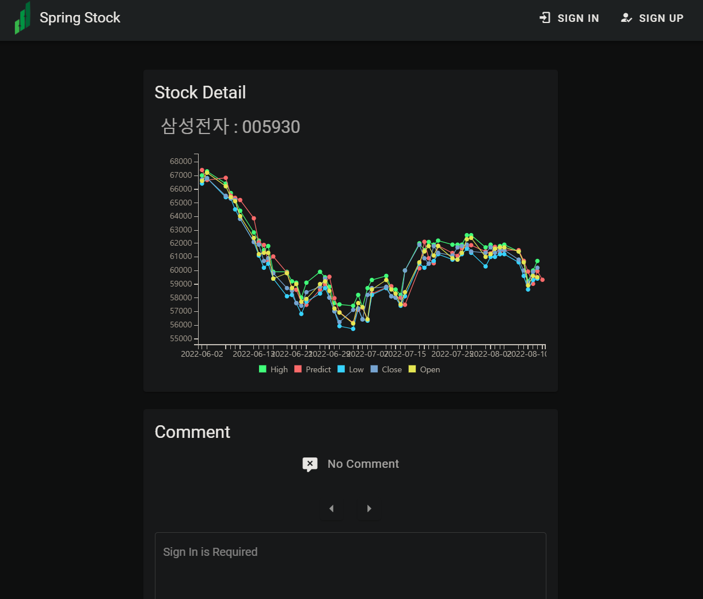
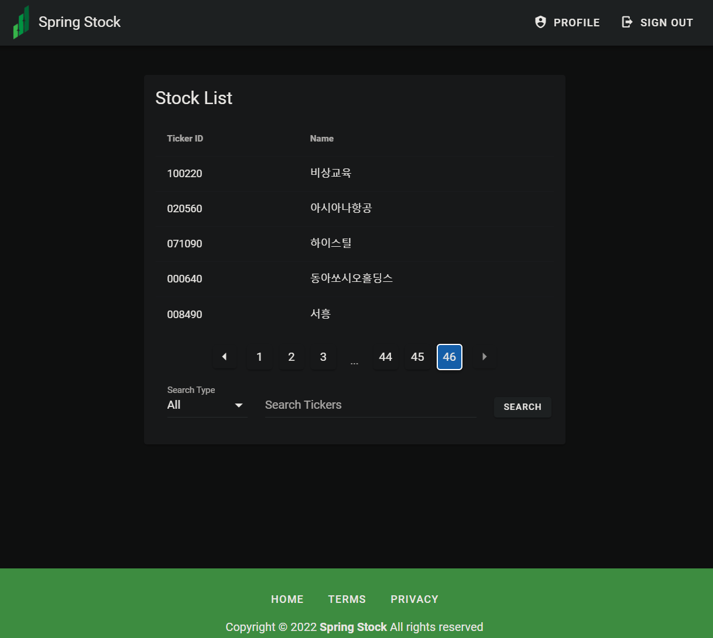
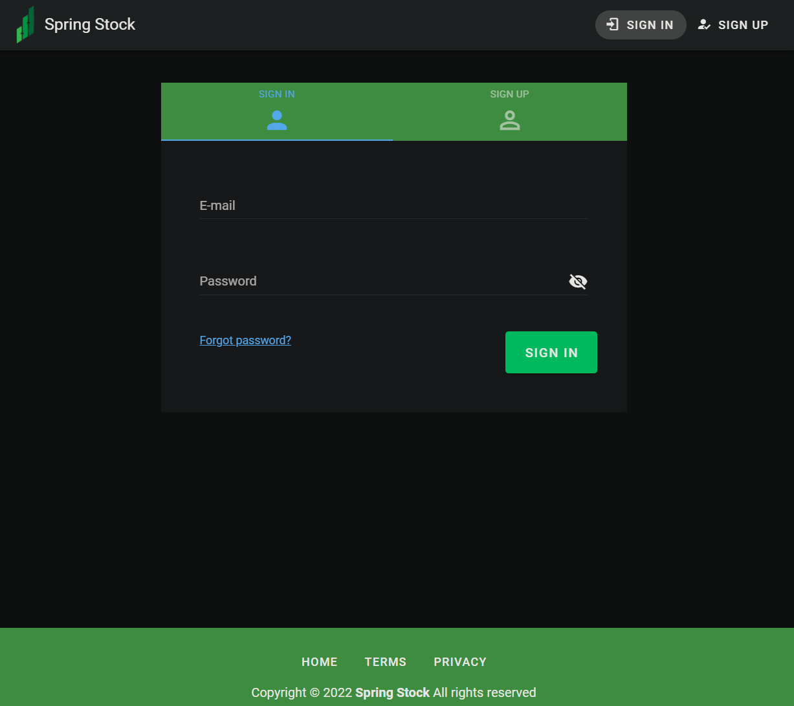
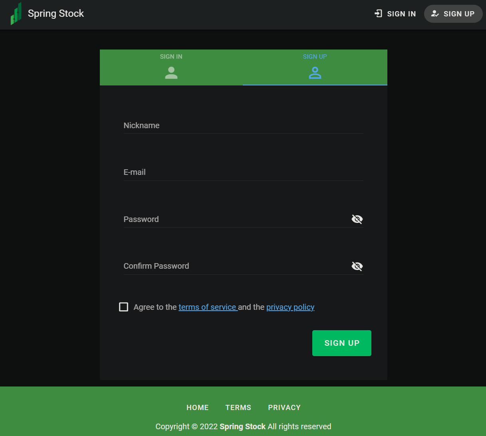
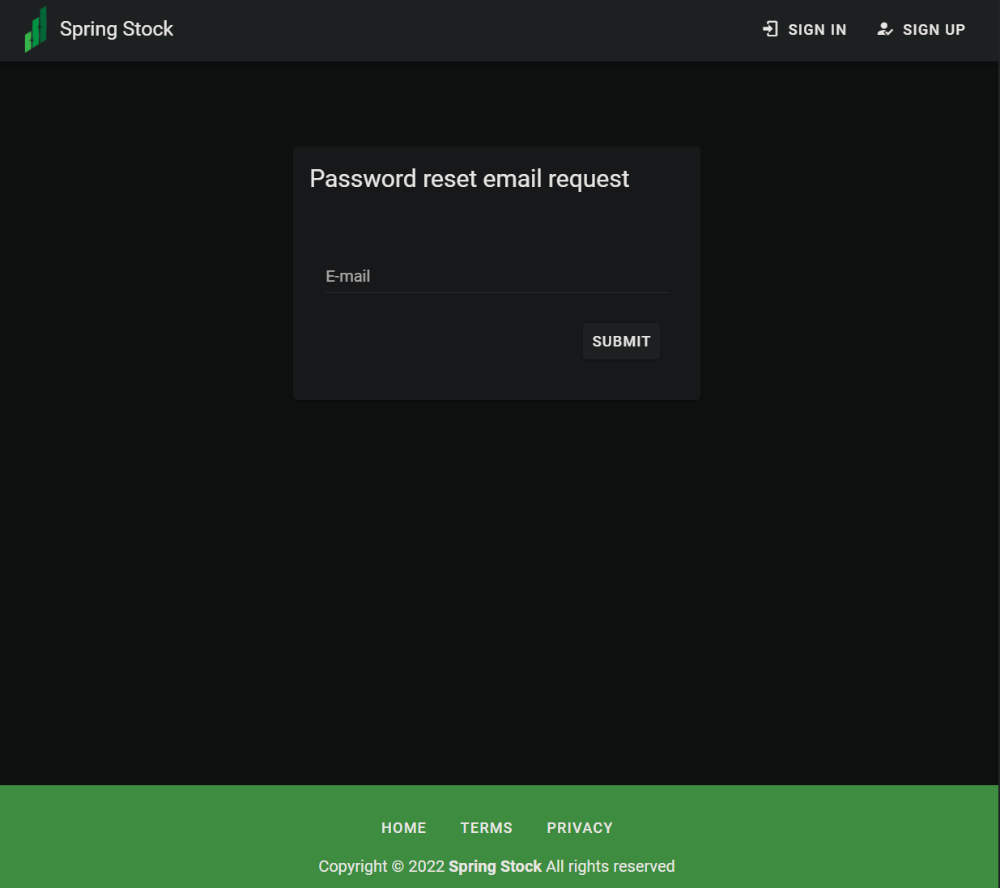
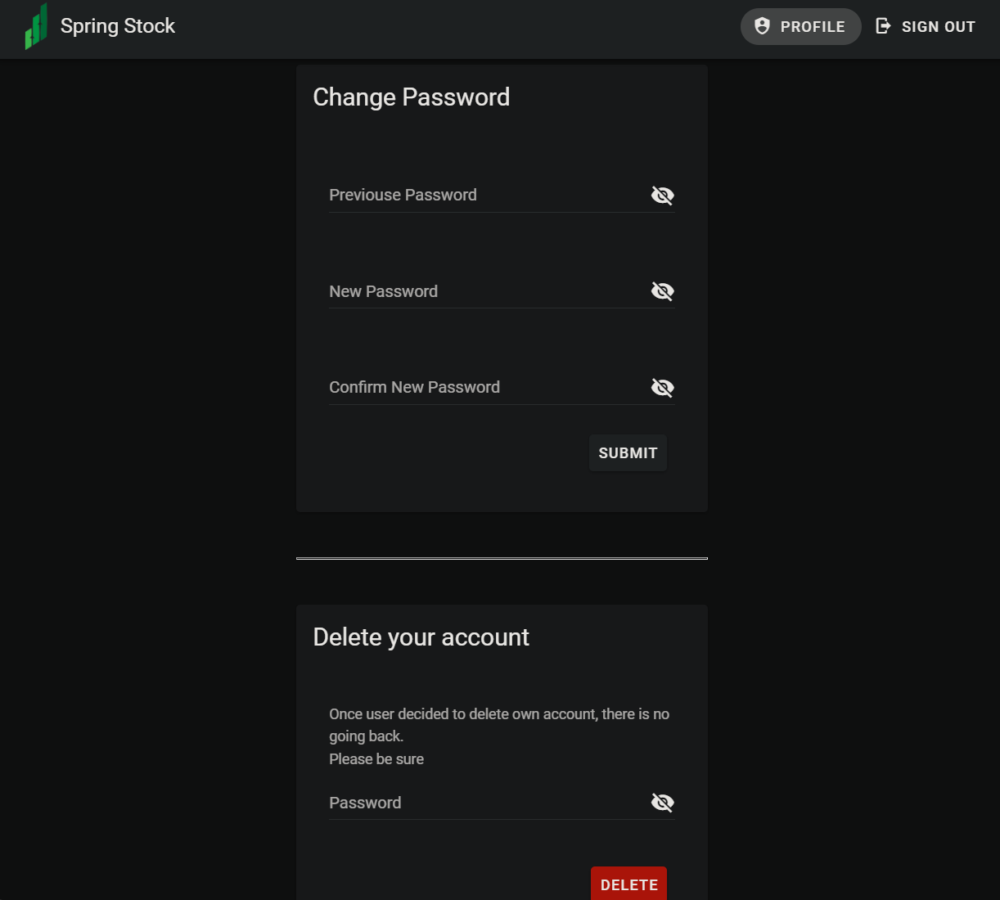
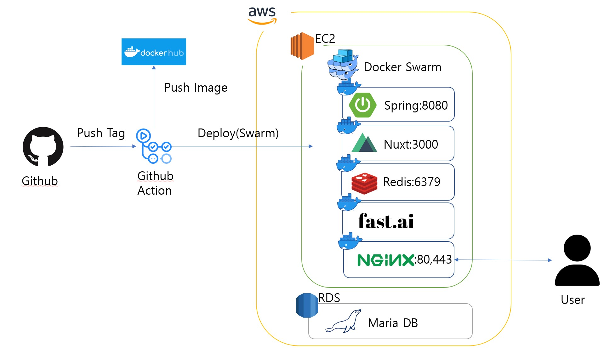

# Spring_Stock


Personal study project for getting used to java spring
Stock prediction web site
Predict KOSPI close price for next day
Check site from [website](https://springstock.ddnsfree.com/)    

# Result   
    
     
    
    
    
    
    


# Model result  
- data
  - KOSPI close price prediction for next day  
  - trained data KOSPI between '2014-01-01' to '2022-01-01'  
  - test data KOSPI between  '2022-01-01' to '2022-07-01'  

- reggression lstm   
  - model structure (LSTM, {'n_layers':1, 'bidirectional': True,"rnn_dropout":0.3,"fc_dropout":0.9})  
  - mse loss 0.000741	 
  - When use it as category classifcation, up down over 0.2% increse than prev close price  
    - expected earning when only buy true prediected :   0.15% per day   
    - expected earning when all buy                  :  -0.10% per day   
    - (this does not include transaction fee(tax))   
    ```
                  precision    recall  f1-score   support   

           False       0.59      0.88      0.71     50376   
            True       0.46      0.14      0.21     35269   

        accuracy                           0.58     85645    
       macro avg       0.52      0.51      0.46     85645   
    weighted avg       0.54      0.58      0.51     85645   
    ```
  
    
    
    
    
# Nuxt run
yarn dev  
       
# Dependncy
- Spring 
  - Java 11
  - Spring boot 2.6.6 
  - JPA, hibernate
  - Spring security
  - mockito
  - flyway
  - lombok
  - h2
  - mariadb
  - redis
- Nuxt
  - pinia
  - billboard.js
  - vue-sweetalert2
- fastai    
  - tsai
    

# Acknowledgement and References 
- [스프링부트로 웹 서비스 출시하기](https://jojoldu.tistory.com/250?category=635883)    
- [spring boot](https://start.spring.io/)   
- [java](https://www.java.com/)    
- [Spring Security를 이용한 회원가입/로그인/로그아웃🐵](https://victorydntmd.tistory.com/328)    
- [Spring Exception Handling](https://bcp0109.tistory.com/303)    
- [Spring Guide - Exception 전략](https://cheese10yun.github.io/spring-guide-exception/)    
- [nuxtjs](https://nuxtjs.org/)    
- [pinia](https://pinia.vuejs.org/ssr/nuxt.html)    
- [Vuetify login](https://www.codeply.com/p/YTg6nsGf3i)    
- [canva](https://www.canva.com/)    
- [termly, Privacy Policy Generator](https://termly.io/)
- [tsai](https://github.com/timeseriesAI/tsai)    
- [fastai](https://github.com/fastai/fastai)    
- [Key takeaways from Kaggle’s most recent time series competition](https://towardsdatascience.com/key-takeaways-from-kaggles-most-recent-time-series-competition-ventilator-pressure-prediction-7a1d2e4e0131)    
- [Deep Learning With Weighted Cross Entropy Loss On Imbalanced Tabular Data Using FastAI](https://towardsdatascience.com/deep-learning-with-weighted-cross-entropy-loss-on-imbalanced-tabular-data-using-fastai-fe1c009e184c)    
- [How to Deal With Imbalanced Classification and Regression Data](https://neptune.ai/blog/how-to-deal-with-imbalanced-classification-and-regression-data)
- [Delving into Deep Imbalanced Regression](https://github.com/YyzHarry/imbalanced-regression)
- [불균형 데이터 해결하기, 주가 예측 프로젝트](https://inhovation97.tistory.com/61?category=960206)    
- [Stanford researchers have developed an AI model, StockBot](https://newstechok.com/stanford-researchers-have-developed-an-artificial-intelligence-ai-model-stockbot-that-uses-lstm-to-predict-the-prices-of-stocks-with-earnings-higher-than-the-most-aggressive-etfs/88861/)    


expectedEarningPerDayWithPred:0.1536%
expectedEarningPerDayWithAllBuy:-0.1043%
